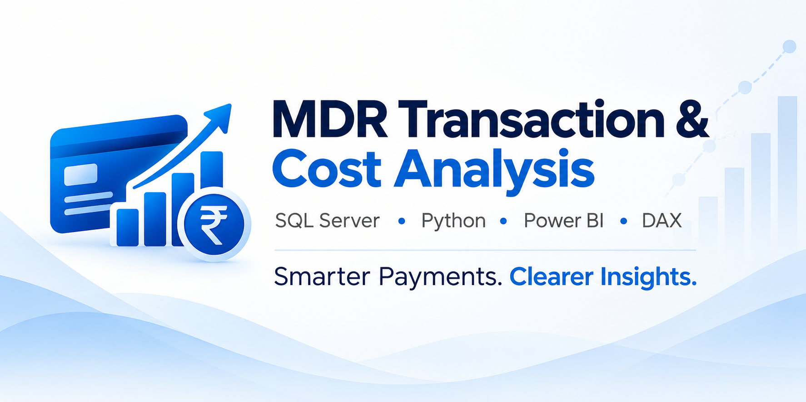
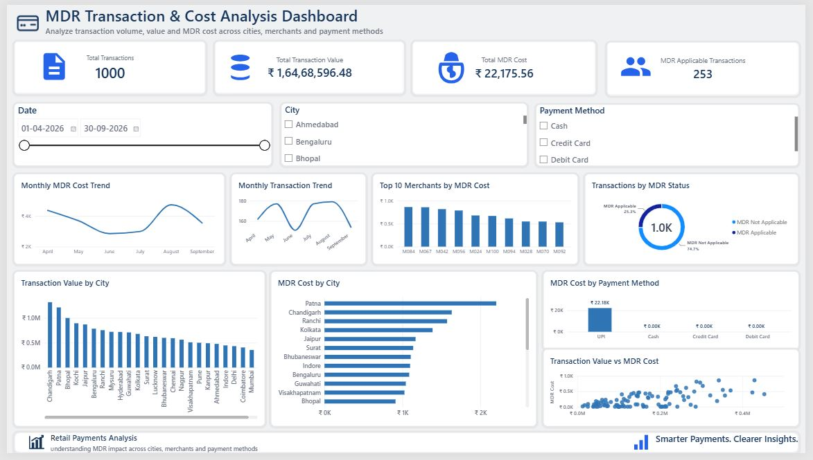
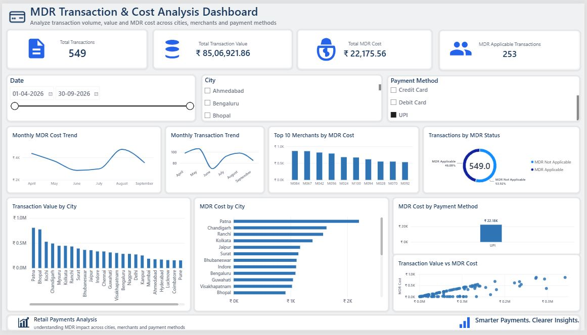

<div align="center">

# MDR Transaction & Cost Analysis

### Smarter Payments. Clearer Insights.

**SQL Server • Python • Power BI • DAX**


</div>

---

## 1. 📌 Brief One-Line Summary

An end-to-end data analytics project that analyzes **Merchant Discount Rate (MDR)** costs across payment methods, merchants, cities, and time using **Python, SQL Server, Power BI, and DAX**.

---

## 2. 📖 Overview

The **MDR Transaction & Cost Analysis** project analyzes payment transaction data to understand where Merchant Discount Rate costs are generated and how those costs vary across different business dimensions.

The project covers the complete analytics workflow:

**Raw Data → Python Cleaning → SQL Validation → MDR Business Logic → Star Schema → DAX Measures → Power BI Dashboard → Business Insights**

The final output is an interactive Power BI dashboard that allows users to investigate MDR performance by:

- Date
- City
- Merchant
- Payment Method
- MDR Applicability
- Transaction Value

The analysis covers **1,000 synthetic payment transactions from April to September 2026**.

---

## 3. ❓ Problem Statement

Merchant Discount Rate represents a transaction processing cost that can directly affect merchant profitability.

The objective of this project was to answer key business questions:

- Which transactions are subject to MDR?
- What percentage of transactions are MDR applicable?
- Which payment method generates MDR cost?
- Which merchants contribute the highest MDR cost?
- Which cities show the highest MDR concentration?
- How does MDR cost change over time?
- Is there a relationship between transaction value and MDR cost?
- How can business users quickly investigate unusual MDR increases?

The goal was to convert transaction-level payment data into a **validated and interactive decision-support dashboard**.

---

## 4. 🗂️ Dataset

The project uses a synthetic payment transaction dataset covering:

| Dataset Detail | Value |
|---|---|
| **Period** | April 1, 2026 – September 30, 2026 |
| **Total Transactions** | 1,000 |
| **Payment Methods** | UPI, Debit Card, Credit Card, Cash |
| **Reporting Level** | Transaction Level |

### Main Transaction Fields

| Category | Example Fields |
|---|---|
| **Transaction** | Transaction ID, Transaction Date, Quantity |
| **Merchant** | Merchant ID, Merchant Size |
| **Customer** | Customer ID |
| **Product** | Product ID |
| **Location** | City ID |
| **Payment** | Payment Method, UPI Type |
| **Financial** | Transaction Amount, Cost of Goods, Gross Profit |
| **MDR** | MDR Eligibility, MDR Applicability, MDR Cost |
| **Status** | Transaction Status |

### Payment Methods

- UPI
- Debit Card
- Credit Card
- Cash

The data was cleaned and validated before being used for SQL analysis and Power BI reporting.

---

## 5. 🛠️ Tools and Technologies

| Technology | Purpose |
|---|---|
| **Python** | Data cleaning, transformation and validation |
| **Pandas** | Transaction-level data preparation |
| **NumPy** | Data processing support |
| **SQL Server** | Querying, validation and MDR business-rule checks |
| **Power BI** | Data modeling and interactive dashboard development |
| **DAX** | KPI and MDR measure creation |
| **GitHub** | Project documentation and portfolio presentation |

---

## 6. ⚙️ Methods

### 6.1 Data Preparation

Python was used to inspect, clean, and prepare the raw transaction data.

The preparation process included:

- Handling missing values
- Cleaning inconsistent category values
- Standardizing payment-method names
- Cleaning UPI P2M/P2P classifications
- Validating transaction dates
- Checking ID integrity
- Validating transaction status
- Preparing the data for SQL and Power BI analysis

### 6.2 MDR Business Logic

Transactions were evaluated using MDR eligibility and exemption rules.

The logic considered:

- Successful transactions
- UPI transactions
- P2M transactions
- Merchant eligibility
- Merchant qualification rules
- Transaction date
- MDR exemptions

After applying the final business rules:

**253 transactions were classified as MDR applicable.**

### 6.3 SQL Validation

SQL Server was used to validate the prepared dataset and reporting outputs.

Validation included:

- Transaction counts
- Transaction values
- MDR applicability
- Payment-method distribution
- Merchant-level results
- City-level results
- Final reporting totals

Power BI KPI results were cross-checked against SQL outputs before the dashboard was finalized.

### 6.4 Data Modeling

A **star schema** was created in Power BI with one central transaction reporting view and six dimension tables.

```text
                          dim_date
                             │
                             │
      dim_merchant ──────────┤
                             │
      dim_customer ── vw_mdr_transactions ── dim_product
                             │
                             ├──────────────── dim_city
                             │
                             └──────────────── dim_payment
```

The model contains six **one-to-many, single-direction relationships** from the dimension tables to `vw_mdr_transactions`.

This structure keeps the model simple, reduces ambiguity, and allows filters from Date, Merchant, Customer, Product, City, and Payment dimensions to propagate correctly to the transaction data.

### 6.5 DAX Measures

Eight reusable DAX measures were created for the main business KPIs:

- Total Transactions
- Total Transaction Value
- Total MDR Cost
- MDR Applicable Transactions
- MDR Applicable Transaction Value
- MDR Rate
- MDR Exempt Transactions
- MDR Exempt Transaction Value

These measures form a reusable KPI layer for the dashboard.

### 6.6 Dashboard Development

The validated model was used to build an interactive Power BI dashboard containing:

- KPI cards
- Date slicer
- City slicer
- Payment Method slicer
- Monthly MDR Cost Trend
- Monthly Transaction Trend
- Top 10 Merchants by MDR Cost
- Transaction Value by City
- MDR Cost by City
- MDR Cost by Payment Method
- Transactions by MDR Status
- Transaction Value vs MDR Cost scatter analysis

---

## 7. 💡 Key Insights

### 7.1 Most Transactions Are Not MDR Applicable

Only **253 out of 1,000 transactions** are MDR applicable.

| MDR Status | Share |
|---|---:|
| **MDR Applicable** | 25.3% |
| **MDR Not Applicable** | 74.7% |

This indicates that MDR eligibility and exemption rules significantly reduce the number of transactions generating MDR cost.

### 7.2 UPI Generates the Recorded MDR Cost

The payment-method analysis shows that all recorded MDR cost in the dataset is associated with **UPI transactions**.

| Payment Method | MDR Cost |
|---|---:|
| **UPI** | ₹22,175.56 |
| Cash | ₹0 |
| Credit Card | ₹0 |
| Debit Card | ₹0 |

This makes UPI the primary payment method for MDR cost monitoring in this dataset.

### 7.3 MDR Cost Changes Over Time

The monthly MDR cost trend shows:

**April → May → June ↓**

**July → August ↑**

**September ↓**

The MDR cost reaches its highest level around **August** before declining again in September.

This helps identify changes in transaction mix and MDR applicability over time.

### 7.4 MDR Cost Is Concentrated Across Merchants and Cities

Merchant-level and city-level analysis shows that MDR cost is not evenly distributed.

The dashboard makes it possible to identify:

- High-cost merchants
- High-cost cities
- Changes in MDR concentration
- Unusual cost increases

### 7.5 Transaction Value and MDR Cost Show a Relationship

The scatter analysis indicates that higher transaction values generally correspond with higher MDR costs.

However, transaction-level variation remains visible, allowing users to investigate unusual observations separately.

---

## 8. 📊 Dashboard / Model / Output

### Main Power BI Dashboard



### Key Dashboard KPIs

| KPI | Result |
|---|---:|
| **Total Transactions** | 1,000 |
| **Total Transaction Value** | ₹1,64,68,596.48 |
| **Total MDR Cost** | ₹22,175.56 |
| **MDR Applicable Transactions** | 253 |
| **MDR Applicable Share** | 25.3% |
| **MDR Not Applicable Share** | 74.7% |

### Interactive Filtering Example — UPI

One of the main features of the dashboard is the ability to dynamically filter the analysis by **Date, City, and Payment Method**.

The example below shows the complete dashboard with **UPI selected**.



### UPI-Filtered KPIs

| KPI | Result |
|---|---:|
| **UPI Transactions** | 549 |
| **UPI Transaction Value** | ₹85,06,921.86 |
| **MDR Cost** | ₹22,175.56 |
| **MDR Applicable Transactions** | 253 |

This demonstrates how business users can isolate a specific payment method and immediately see its effect across all KPIs and visuals.

### 📥 Power BI File

The interactive `.pbix` dashboard file is available here:

[**Open Power BI Project**](dashboard/MDR_Transaction_Analysis_Dashboard.pbix)

### 📄 Portfolio Case Study

A concise recruiter-facing case study covering the business problem, methodology, data model, insights, dashboard, and business value is available here:

### 👉 [View MDR Portfolio Case Study](docs/Dipendu_Roy_MDR_Portfolio_Case_Study.pdf)

---

## 9. ▶️ How to Run This Project

### Step 1 — Clone the Repository

```bash
git clone https://github.com/Dipendu95/MDR-Transaction-Cost-Analysis.git
```

Navigate into the project folder:

```bash
cd MDR-Transaction-Cost-Analysis
```

### Step 2 — Explore the Raw Data

The source data used for the project is available inside:

```text
data/raw/
```

### Step 3 — Run the Python Analysis

Python notebooks/scripts used for data preparation and validation are available inside:

```text
python/
```

Main Python libraries used:

```text
pandas
numpy
```

### Step 4 — Run the SQL Analysis

SQL scripts used for validation and business-rule analysis are available inside:

```text
sql/
```

The scripts can be executed using **SQL Server / SQL Server Management Studio**.

### Step 5 — Open the Power BI Dashboard

The Power BI project is located at:

```text
dashboard/MDR_Transaction_Analysis_Dashboard.pbix
```

Download the `.pbix` file and open it using **Power BI Desktop**.

---

## 10. ✅ Results & Conclusion

The project successfully converts transaction-level payment data into a structured analytics solution for MDR monitoring.

The final solution delivers:

- Cleaned and validated transaction data
- MDR applicability business logic
- SQL-based validation
- A six-dimension star schema
- Reusable DAX measures
- An interactive Power BI dashboard
- Merchant-level MDR analysis
- City-level MDR analysis
- Payment-method analysis
- Monthly MDR trend monitoring
- Interactive root-cause analysis through slicers

From **1,000 total transactions**, **253 transactions were identified as MDR applicable**, representing **25.3% of the dataset**.

The total recorded MDR cost was **₹22,175.56**, with all recorded MDR cost associated with **UPI transactions** in this dataset.

The final reporting model makes MDR **cost concentration, trends, payment-method impact, and applicability patterns** visible in a single interactive dashboard.

---

## 11. 🔮 Future Work

This project can be extended further by:

- Scaling the analysis to a larger transaction dataset
- Adding year-over-year MDR comparisons
- Comparing MDR cost with merchant gross profit
- Adding merchant profitability analysis
- Creating merchant-level drill-through pages
- Adding automated MDR cost alerts
- Building MDR forecasting models
- Automating data refresh
- Comparing alternative MDR pricing scenarios
- Evaluating the effect of future MDR-rule changes on merchant profitability

---

## 12. 👤 Author & Contact

### Dipendu Roy

**Aspiring Data Analyst | SQL • Python • Power BI • Excel**

I built this project as part of my data analytics portfolio to demonstrate practical skills in:

`SQL` `Python` `Power BI` `DAX` `Data Cleaning` `Data Validation` `Star Schema` `Data Modeling` `KPI Development` `Business Analysis` `Data Visualization` `Data Storytelling`

### 📬 Contact

**Email:** [roy.dipendu.1995@gmail.com](mailto:roy.dipendu.1995@gmail.com)

**LinkedIn:**

[](https://www.linkedin.com/in/dipenduroy/)

**Gmail:**

[](mailto:roy.dipendu.1995@gmail.com)

---

<div align="center">

### MDR Transaction & Cost Analysis

**Smarter Payments. Clearer Insights.**

Built by **Dipendu Roy**

</div>
